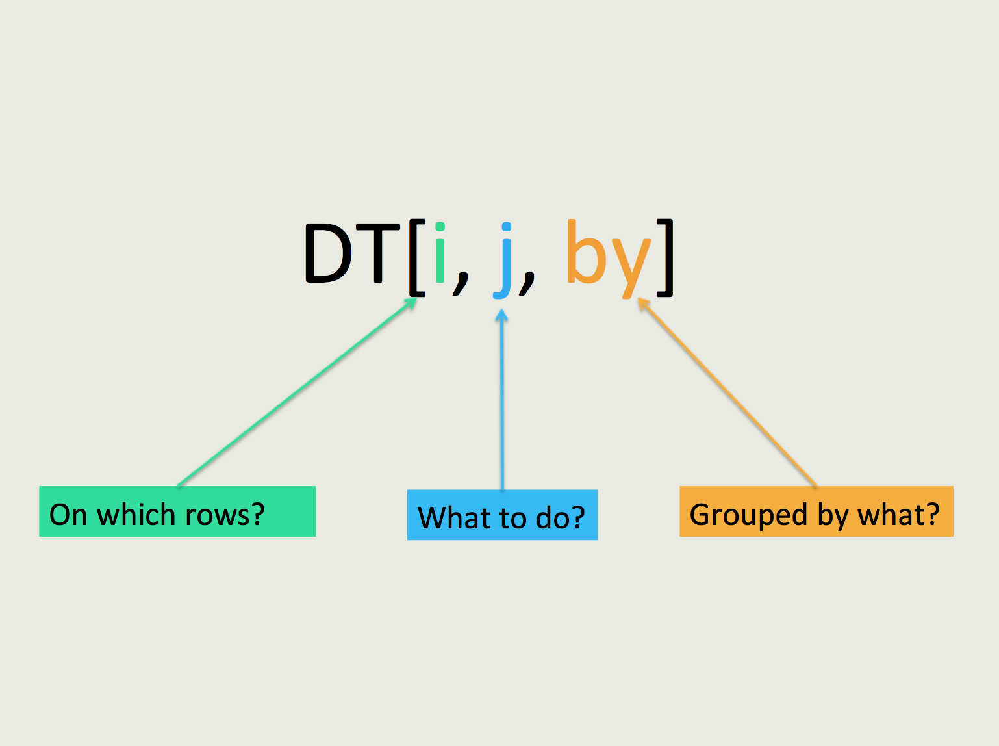

##Introduction
This is a basic overview of the data.table package in R. My goal is to intruduce you to what data.table has to offer. This is not a comparison with dylyr, you can google that stuff if you want.

Authored by Matt Dowle and Arun Srinivasan, first introdued in 2006, to be quicker and more efficient than other methods.

##Getting Started



<br>

```{r}
library(data.table)

DT <- data.table(x = 1:5,
                 y = c("a", "b", "a", "b", "c"),
                 z = c(42, 23, 35, 64, 23))
str(DT)
```


##Other Resources
Check out the [Github page](https://github.com/Rdatatable/data.table/wiki) for lots of more information.

